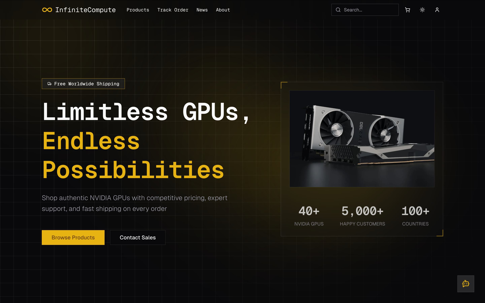
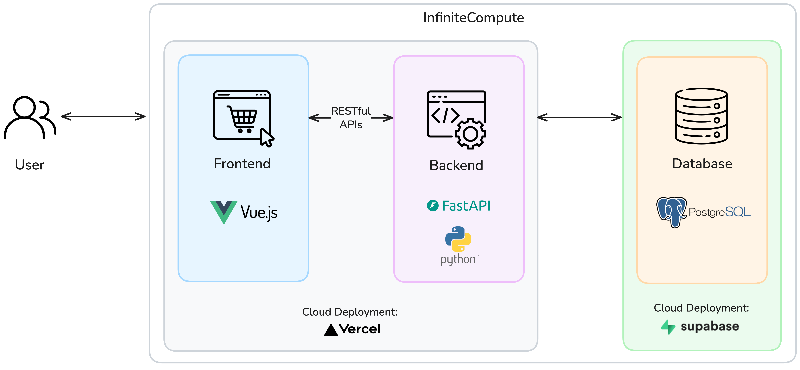
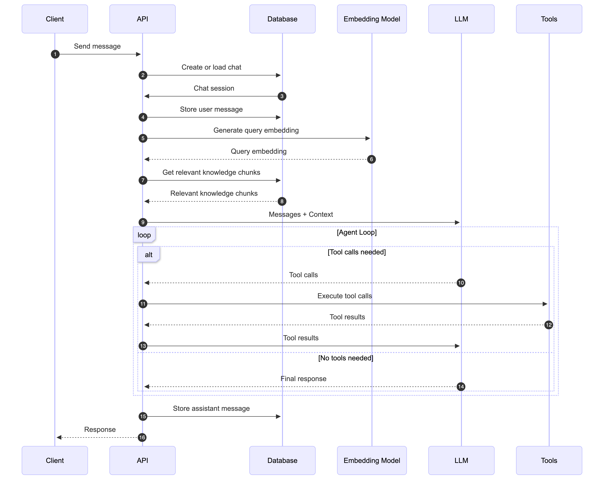

# InfiniteCompute: Full-Stack, AI-Powered E-Commerce Platform

## Introduction



InfiniteCompute is an e-commerce store for NVIDIA GPUs. Its main features include:

- **AI Advisor**: Assists customers in finding the right GPU, using information from internal documents, product database, and real-time web search, implemented using agentic RAG
- **Admin Dashboard**: Data analytics and management tools for staff and admins, with role-based access control
- **Order Tracking, Reviews, Discounts, etc.**: Everything you expect from a modern e-commerce platform

See it in action: https://infinitecompute.vercel.app/

## Installation

1. Clone the repository:

```bash
git clone https://github.com/lengvietcuong/infinite-compute.git
cd infinite-compute
```

**(Optional)**: Edit `OPEN_ROUTER_API_KEY` and `BRAVE_API_KEY` in `docker-compose.yml` if you wish to use the AI advisor feature. If not, the rest of the application will still work.

2. Initialize the database (only needed on first run):

```bash
docker compose up db -d && docker compose run --rm backend python -m database.initialize_database
```

3. Start the full application:

```bash
docker compose up
```

You can then access the application at:

- Frontend: http://localhost:5173
- Backend API docs: http://localhost:8000/docs

## System Architecture



| Type     | Technology     | Reasoning                                                              |
| -------- | -------------- | ---------------------------------------------------------------------- |
| Frontend | Vue.js 3       | Modern, reactive UI framework with composable logic                    |
| Backend  | Python FastAPI | High performance, automatic API docs, modern Python ecosystem          |
| Database | PostgreSQL     | Open-source, reliable RDBMS, with pgvector extension for AI RAG system |

## AI Advisor

### Flow



The AI advisor uses agentic RAG to retrieve relevant information to answer user questions. We first generate an embedding of the user's query to retrieve relevant knowledge chunks using vector similarity search. These chunks, along with the conversation history, are sent to the LLM, which can either respond directly or call tools to search for more information (like querying the product database or performing a web search). If tools are needed, the backend executes them and sends the results back to the LLM. This process repeats until a final answer is generated.

### AI Technology Stack

| Type            | Name                  | Justification                                                                                                                             |
| :-------------- | :-------------------- | :---------------------------------------------------------------------------------------------------------------------------------------- |
| Embedding Model | Qwen3 8B              | Ranks \#1 on the MTEB benchmark for multilingual text embeddings, with strong performance across diverse tasks.                           |
| LLM             | Gemini 3 Flash        | Optimized for speed and scale with frontier intelligence, making it ideal for real-time conversational AI with tool calling capabilities. |
| Vector Database | pgvector (PostgreSQL) | Provides native vector similarity search within PostgreSQL, eliminating the need for a separate vector database infrastructure.           |
| Web Search API  | Brave Search API      | Easy to use API that provides 2000 free queries per month                                                                                 |

### Available Tools

| Tool Name      | Description                                                    | Inputs                                                                                                             | Outputs                                                      |
| :------------- | :------------------------------------------------------------- | :----------------------------------------------------------------------------------------------------------------- | :----------------------------------------------------------- |
| list_documents | Lists all available Markdown documents in the knowledge base   | None                                                                                                               | List of document filenames                                   |
| list_sections  | Extracts section headings from specified documents             | **documents**: Array of document names                                                                             | Hierarchical list of section headings                        |
| read_sections  | Retrieves the full content of specific sections from documents | **sections**: Array of section headings **documents:** Array of document names                                     | Full text content of requested sections                      |
| keyword_search | Performs full-text keyword search across the knowledge base    | **keywords**: Array of search keywords **target_documents**: Optional array of specific documents                  | Ranked relevant text chunks                                  |
| web_search     | Searches the web using Brave Search API                        | **query**: Search query string                                                                                     | Formatted web search results with titles, URLs, descriptions |
| get_product    | Retrieves details for a single GPU product by name             | **product_name**: Product name or partial name (e.g., 4090\)                                                       | Product specifications, price, and stock status              |
| list_products  | Lists all available GPU products                               | None                                                                                                               | Complete list of GPU products with basic info                |
| get_products   | Searches and filters GPU products by multiple criteria         | **product_names**, **min_price**, **max_price**, **min_memory**, **product_line**, **architecture**, **min_stock** | Filtered list of products with specs, prices, and stock      |

## APIs

The API is organized into 10 main routers, each handling a specific domain. The following table provides a high-level overview of each API group:

| API Group          | Prefix           | Primary Function                           |
| :----------------- | :--------------- | :----------------------------------------- |
| **Authentication** | `/auth`          | User registration and login                |
| **Users**          | `/users`         | User management for admins                 |
| **Products**       | `/products`      | GPU product catalog                        |
| **Orders**         | `/orders`        | Order processing and tracking              |
| **Reviews**        | `/reviews`       | Product reviews and ratings                |
| **News**           | `/news`          | News article management                    |
| **Analytics**      | `/analytics`     | Business metrics and insights              |
| **Chat**           | `/chat`          | AI chatbot interactions                    |
| **Conversations**  | `/conversations` | Chat history between users and the chatbot |
| **Coupons**        | `/coupons`       | Discount code management                   |

The full documentation is automatically generated and available at `/docs` when the backend server is running (e.g. http://localhost:8000/docs).
